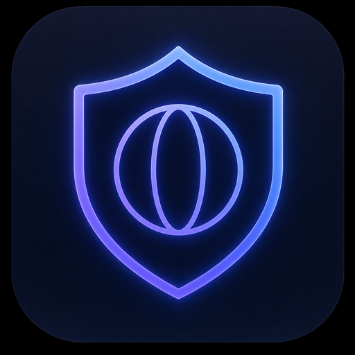

<div align="center">



# MiniBrowser

**A security-first minimal web browser with a detached, floating control bar.**

Windows · macOS · Linux

</div>

---

## What makes it different

The page and the browser UI live in **two separate OS windows**.

- **Content window** — *only* the webpage. Frameless: no title bar, no native menu, no buttons, no borders. The page is rendered edge to edge and nothing else exists in that window.
- **Control bar** — its own frameless, transparent, always-on-top window that floats over everything like a picture-in-picture player. It owns **every** menu, button and control in the application. Drag it anywhere, resize it, park it on a second monitor.

Because the bar is a genuinely separate window with its own renderer process, a compromised page has **no DOM access to the address bar at all** — it cannot spoof the URL, fake the lock icon, or phish your input.

## Security model

The rendered page is treated as fully hostile. Every layer below is on by default.

| Layer | Protection |
|---|---|
| **Process** | Chromium sandbox forced on (`app.enableSandbox()`), `site-per-process` site isolation, strict origin isolation |
| **Renderer** | `contextIsolation: true`, `nodeIntegration: false`, `sandbox: true`, `webviewTag: false`, DevTools disabled, `AutomationControlled` disabled |
| **IPC** | No generic invoke bridge. Each capability is a hard-coded channel; the main process rejects any message that did not come from the toolbar window |
| **Navigation** | `javascript:`, `file:`, `chrome:`, `devtools:` and every unknown scheme are refused. Bare hostnames are upgraded to HTTPS |
| **Popups** | `setWindowOpenHandler` denies all window creation; `will-attach-webview` is blocked |
| **Permissions** | Camera, mic, location, notifications, USB, HID, serial and Bluetooth are **denied by default**. You grant them per-site, per-session, from the menu |
| **Certificates** | Invalid certificates are never overridable — the load simply fails |
| **Downloads** | Blocked from starting silently; you are notified instead |
| **Tracking** | Built-in blocklist (analytics, ads, fingerprinting, session replay), matched by hostname suffix so query-string tricks cannot bypass it |
| **Cookies** | Third-party `Cookie` and `Referer` headers stripped on the way out; third-party `Set-Cookie` stripped on the way in |
| **Headers** | `DNT: 1` and `Sec-GPC: 1` sent on every request |
| **UI** | Toolbar page ships a strict CSP: `default-src 'none'`, no inline script, no remote origins |

One click on **Clear all browsing data** wipes cookies, localStorage, IndexedDB, service workers, caches, auth cache, DNS cache, and every permission grant.

## The floating bar

```
 ┌──────────────────────────────────────────────────────────┐
 │ 🛡  File  Edit  View  History  Privacy  Window    ─ □ ✕  │  ← menubar
 │  ‹  ›  ⟳  ⌂   🔒 en.wikipedia.org/wiki/…    🛡 7    ✥    │  ← navigation
 │ ────────────────────── progress ──────────────────────── │
 │ 🔍 find in page                        3/12   ˄ ˅  ✕     │  ← find (Ctrl+F)
 └──────────────────────────────────────────────────────────┘
```

**Row 1 — the menubar.** A full application menubar, hover-to-slide between menus just like a native one:

| Menu | Contains |
|---|---|
| **File** | New address, home, copy page address, open in system browser, print, quit |
| **Edit** | Undo/redo, cut/copy/paste, select all, find in page |
| **View** | Reload, hard reload, stop, zoom in/out/reset (live %), full screen |
| **History** | Back, forward, home, plus current page + connection status |
| **Privacy** | Tracker count, per-site grants (camera / mic / location / notifications), blocked-request report, clear all data |
| **Window** | Minimize, maximize, center, snap left/right/fill, "bar follows page window" toggle |

Window buttons (─ □ ✕) on the right control the **page** window and live here too.

**Row 2 — navigation.** Back / forward / reload-stop / home, the omnibox (URL, bare hostname, or a DuckDuckGo search), a lock indicator (green HTTPS, amber otherwise), the tracker shield, and a **✥ move handle** — since the page window is frameless, you drag it from here.

**Row 3 — find in page**, opened with `Ctrl/Cmd+F`, with match counts and next/previous.

The bar grows and shrinks automatically as menus and the find bar open.

### Responsive

The bar reflows as you resize it: menu titles drop out progressively (Edit/Window at 700px, File/History at 560px, View at 420px), the home button and move handle hide at 560px, and on touch screens (`pointer: coarse`) every hit target grows to 42px. Dark and light themes follow the OS, and `prefers-reduced-motion` is respected.

### Shortcuts

| | |
|---|---|
| `Ctrl/Cmd + L` | Focus address bar |
| `Ctrl/Cmd + R` | Reload (`+Shift` bypasses cache) |
| `Alt + ← / →` | Back / forward |
| `Ctrl/Cmd + + / − / 0` | Zoom in / out / reset |
| `Ctrl/Cmd + F` | Find in page |
| `Ctrl/Cmd + P` | Print |
| `Ctrl/Cmd + Shift + C` | Copy page address |
| `F11` | Full screen the page window |
| `Esc` | Close menu / find bar, or revert the address bar |

## Running it

```bash
npm install
npm start
```

> **Note:** `npm install` downloads the Chromium binary from GitHub releases. If you are behind a restricted network, set a mirror first:
> ```bash
> export ELECTRON_MIRROR=https://npmmirror.com/mirrors/electron/
> npm install
> ```

## Tests

```bash
npm test
```

Covers URL normalisation (including rejection of `javascript:` / `file:` / `chrome:`) and the tracker blocklist matcher. Electron is stubbed, so it runs under plain Node.

## Building installers

```bash
npm run dist:win     # NSIS installer + portable .exe
npm run dist:mac     # .dmg + .zip (hardened runtime)
npm run dist:linux   # AppImage + .deb
npm run dist:all     # all three
```

Output lands in `release/`. Cross-compiling to macOS requires macOS; Windows and Linux targets can be built from Linux.

## UI preview without Electron

```bash
python3 -m http.server 3000
# open http://localhost:3000/preview/
```

Runs the real toolbar HTML/CSS/JS against a mock bridge so you can see the layout and responsive behaviour in any browser.

## Layout

```
src/
  main/
    main.js             app lifecycle, two windows, IPC handlers
    security.js         hardening policy, permissions, URL normalisation
    tracker-blocker.js  hostname-suffix blocklist + cookie stripping
  preload/
    toolbar-preload.js  the entire (tiny) privileged API surface
  renderer/toolbar/     the floating bar UI
preview/                browser-only mock for previewing the UI
test/logic.test.js      pure-logic tests
```

## License

MIT
